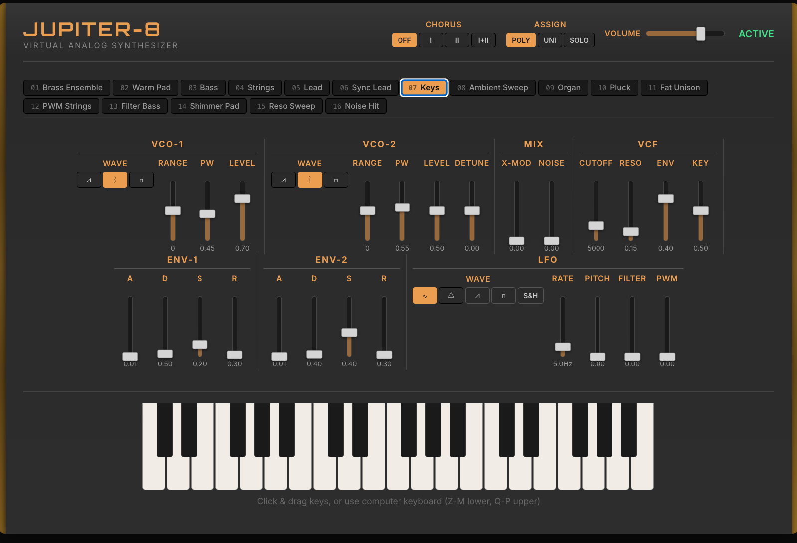

# JP-8 Virtual Analog Synthesizer

A browser-based Roland Jupiter-8 emulation built with Rust/WASM and Web Audio.



## Architecture

**Rust DSP engine** (`crates/jp8-core`) compiled to WASM, running inside an AudioWorklet. Zero heap allocations in the render path.

```
VCO-1 (PolyBLEP) ──┐
                    ├─ Mixer ─→ IR3109 Filter ─→ VCA ─→ BBD Chorus ─→ Output
VCO-2 (PolyBLEP) ──┘              ↑               ↑
Noise ──────────────┘         ENV-1 (ADSR)    ENV-2 (ADSR)
                                   ↑
                              LFO (5 shapes)
```

- **Oscillators**: PolyBLEP anti-aliased saw, pulse, square with analog drift and cross-modulation
- **Filter**: IR3109 4-pole OTA ladder with `tanh` saturation, trapezoidal integration, 2x oversampling
- **Envelopes**: Two ADSR — ENV-1 modulates filter cutoff, ENV-2 controls VCA amplitude
- **LFO**: Sine, triangle, saw, square, sample & hold → pitch, filter, PWM destinations
- **Chorus**: Stereo BBD emulation — Mode I (0.5 Hz), Mode II (0.9 Hz), I+II
- **Voices**: 8-voice polyphony with Poly/Unison/Solo modes and voice stealing
- **16 factory presets**: Brass, pads, bass, strings, leads, keys, ambient, percussion

## Parameter Transport

SharedArrayBuffer for lock-free UI→Audio parameter writes (32 × f32). postMessage for note events only. Audio thread never calls postMessage during rendering.

## Running

```bash
# Prerequisites
rustup target add wasm32-unknown-unknown
cargo install wasm-pack

# Build WASM
wasm-pack build crates/jp8-wasm --target web --release --out-dir ../../pkg

# Install JS deps and run
bun install
bun run dev
```

Open http://localhost:5173. Click **Start Audio**, then play with mouse, computer keyboard (Z–M lower octave, Q–P upper), or MIDI controller.

## MIDI

Web MIDI supported in Chrome. Mod wheel → LFO pitch depth, CC74 → filter cutoff, CC71 → resonance.

## Tech Stack

| Layer | Tech |
|-------|------|
| DSP | Rust (`no_std` compatible, 46KB WASM) |
| Audio thread | AudioWorklet + wasm-bindgen |
| Params | SharedArrayBuffer (lock-free) |
| UI | React 19 + TypeScript |
| Build | Vite + wasm-pack |
